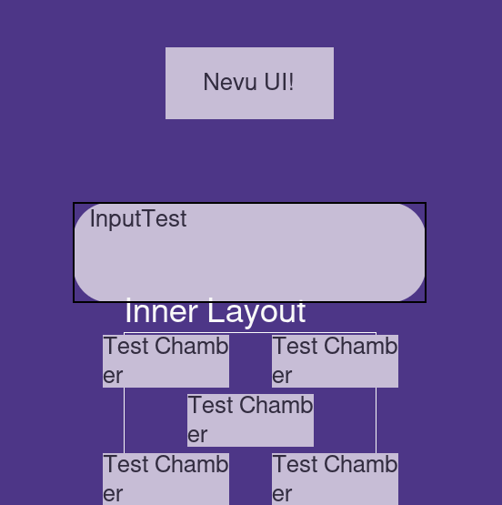
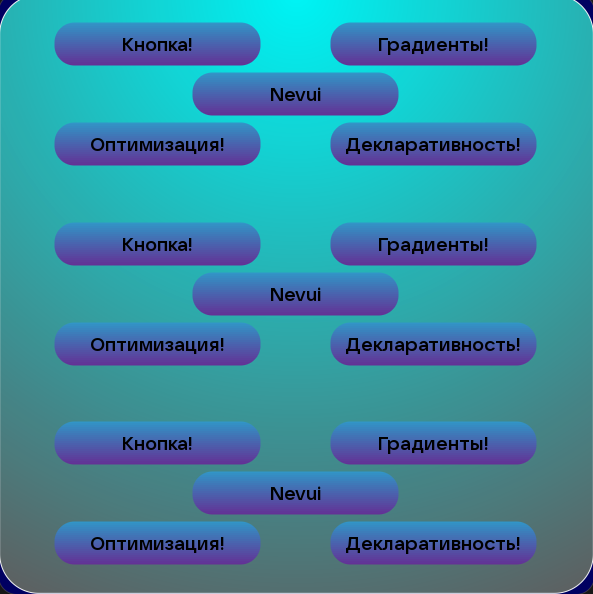
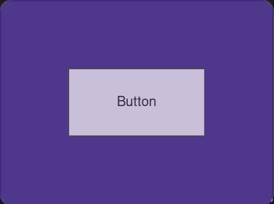

# Wiki link(BETA!)
 * <a href="https://golembebrov.github.io/nevu-docs/">NevuDocs</a>

### Nevu UI means: `Nevu is Eleven times better Versus other UI's User Interface`

# Brief Description
**Nevu UI** is a library for the declarative creation of user interfaces in python. The project aims to provide developers with a set of ready-made, stylable, and extensible components for the rapid creation of modern and responsive interfaces in games and multimedia applications.

#### The main goal of Nevu UI: to make creating interfaces in python easier and faster

### Key features include:
*   **Layout system:** Convenient arrangement of elements, for example, using grids (Grid) and scrollable containers (ScrollableColumn).
*   **Set of widgets:** Ready-to-use elements such as buttons, input fields, and labels.
*   **Flexible styling:** The ability to customize the appearance through a style system that supports colors, gradients, and borders.
*   **Animations:** Built-in support for animations to create dynamic and lively interfaces.
*   **Declarativeness:** Support for declarative interface creation

## Style

### Style - storage of parameters for customizing the appearance
Editable parameters:

* **Gradient**
* **ColorTheme** - Analogous to MaterialDesign, there is a ready-made set of themes - `ColorThemeLibrary`
* **Font name/size**
* **Border Width/Radius**
* **Text Align X/Y**
* **Transparency**

## Main Features

### Nevu UI allows you to describe an interface with a clear structure

Examples of declarativeness:

*   **Declarative approach:** Describe your interface just as you see it.
    ```python
    # Specify content directly when creating the layout
    grid = ui.Grid(content={(1,1): ui.Button(...)})
    ```
*   **Adaptive size system (`SizeRules`):** Forget about pixels. Use relative values that adjust to the size of the window or parent element.
    *   `vh` / `vw`: Percentage of the window's height/width.
    *   `fillx` / `filly` / `fill`: Percentage of the parent layout's height/width/size.
    *   `gc` / `gcw` / `gch`: Percentage of the grid cell size.
    *   Prefix `c`: can be placed in any SizeRule, it means that the current value will be taken (without the prefix, the original will be taken).
*   **Powerful style system:** Customize every aspect of the appearance using the universal `Style` object.
    *   **Themes:** Ready-made color themes in `ColorThemeLibrary`.
    *   **Gradients:** Support for linear and radial.
    *   **Image:** Support for a background image via the `bgimage` parameter.
    *   **And much more:** Fonts, borders, rounding, transparency.
*   **Built-in animations:** Bring your interface to life with ready-made animations for movement, transparency, etc.
    * **25+ built-in animations**
    * There are **2** types of animations:
        *   **Start** - Allows you to set the initial appearance of the widget.
        *   **Infinite** - Produces an infinite animation defined in `animation_manager`.
    * Usage example:
       * **Start:**
         ```widget.animation_manager.add_start_animation(ui.animations.EaseOut(...))```
       * **Infinite:**
         ```widget.animation_manager.add_continuous_animation(ui.animations.EaseOut(...))```

**Parameter System** (ParamEngine):

*   `ParamEngine` is a convenient tool built into all layouts and widgets, it allows you to:
    * Declaratively add variables to the object's `__init__`
    * Check the variable type during initialization and after
    * Integrate a parameter into different stages of initialization
    * Retrieve parameter values via `self.get_param(param_name).get()`
    * Set parameter values via `self.get_param(param_name).set(value)`
*   **Examples:**
    ```python
    import nevu_ui as ui
    from typing import Unpack, NotRequired

    #Create a TypedDict with variables (optional, but looks nice)
    class MyWidgetKwargs(ui.WidgetKwargs):
        my_var: NotRequired[int | float]

    class MyWidget(ui.Widget):
        def __init__(self, size: NvVector2 | list, style: Style = default_style, **param_kwargs: Unpack[MyWidgetKwargs]):
            super().__init__(size, style, **param_kwargs)

        #Override the function to add parameters (mandatory)
        def _add_params(self):
            super()._add_params()

            #Add a parameter (mandatory)
            self._add_param('my_var', int | float)

            #You can also add a link to a parameter
            #self._add_param_link('my_var', 'my_var_new_name')

            #You can also block a parameter if necessary
            #self._block_param('my_var')
    ```

# Installation
  ## Dependencies:
  **```Python >= 3.12.*```**
  * For Building:
    * ```setuptools >= 61.0```
    * ```Cython```
    * ```numpy```
  * For Running:
    * ```numpy```
    * ```Pillow```
  * Additional libraries:
    * ```pygame-ce>=2.3.0``` 
    * ```raylib```
    * ```pyyaml```
 ## Installation via pip
 ```python
 pip install nevu-ui[all]
 ```

# Examples

---



---
### Basic Grid
#### Declarative Approach
```python
import nevu_ui as ui #Import Nevu UI
import pygame

pygame.init()

class MyGame(ui.Manager): #Create the base of our application
    def __init__(self):
        super().__init__(ui.Window((400, 300), title = "My Game")) #Initialize the manager
        style = ui.Style(borderradius=20, colortheme=ui.ColorThemeLibrary.material3_dark) #Create Style (optional)
        self.menu = ui.Menu(self.window, [100%ui.vw, 100%ui.vh], style = style, #Create a menu
                            layout= ui.Grid([100%ui.vw, 100%ui.vh], row=3, column=3, #Create a grid layout
                                            content = {
                                                (2, 2): ui.Button(lambda: print("You clicked!"), "BUTTON!", [50%ui.fill, 50%ui.gc], style=style) #Create a button
                                            }
                                            )
                            )
    def on_draw(self):
        self.menu.draw() #draw the menu
    def on_update(self, events):
        self.menu.update() #update the menu

game = MyGame()
game.run() #Run the finished application
```
#### Imperative Approach
```python
import nevu_ui as ui #Import Nevu UI
import pygame

pygame.init()

window = ui.Window((400, 300), title = "My Game") #Create a window

style = ui.Style(borderradius=20, colortheme=ui.ColorThemeLibrary.material3_dark) #Create Style
menu = ui.Menu(window, [100%ui.vw, 100%ui.vh], style=style) #Create a menu
layout = ui.Grid([100%ui.vw, 100%ui.vh], row=3, column=3) #Create a grid layout
layout.add_item(ui.Button(lambda: print("You clicked!"), "BUTTON!", [50%ui.fill, 50%ui.gc], style=style), x = 2, y = 2) #Create a button

menu.layout = layout #Set the menu layout

while True: #Main loop
    events = pygame.event.get() #Get events
    window.update(events) #Update the window
    menu.update() #Update the menu
    menu.draw() #Draw the menu
    pygame.display.update() #Update the screen

```


### Example Result

---
# Nevu UI Status at the Moment

### **Layouts (Layout_Type Heirs)**

(✅ - done, ❌ - not done, 💾 - deprecated and not working)

*   ✅ `Grid`
*   ✅ `Row`
*   ✅ `Column`
*   ✅ `ScrollableRow`
*   ✅ `ScrollableColumn`
*   ✅ `ColorPicker`
*   💾 `Pages`
*   💾 `Gallery_Pages`
*   ✅ `StackColumn`
*   ✅ `StackRow`
*   ✅ `CheckBoxGroup`

### **Widgets (Widget Heirs)**

*   ✅ `Widget`
*   ✅ `Button`
*   ✅ `Label`
*   ✅ `Input`
*   ✅ `EmptyWidget`
*   ✅ `Tooltip` (Pygame exclusive, for now)
*   💾 `Gif`
*   ❌ `MusicPlayer` (Will be reworked, i guess?)
*   ✅ `ProgressBar`
*   ✅ `SliderBar`
*   ✅ `ElementSwitcher`
*   💾 `FileDialog`
*   ✅ `RectCheckBox`

### **Available Backends**

*   ✅ `Pygame-ce`
*   ✅ `Pygame-ce._sdl2(Sdl)`
*   ✅ `RayLib`

## Backend Exclusives

* `Ripple effect` - **Raylib exclusive**
* `Transparent colors inside Gradient` - **Raylib exclusive**
* `Customizable center and angle of the gradient` - **Raylib exclusive**
* `Tooltip` - **Pygame exclusive**

# License

**Nevu UI is protected by the MIT license**

# Bugs

* **Nevu UI** is **NOT** a stable framework, you may encounter many bugs in it.

# Additional Information

* **Gmail:** bebrovgolem@gmail.com
* **Creator:** Nikita A.