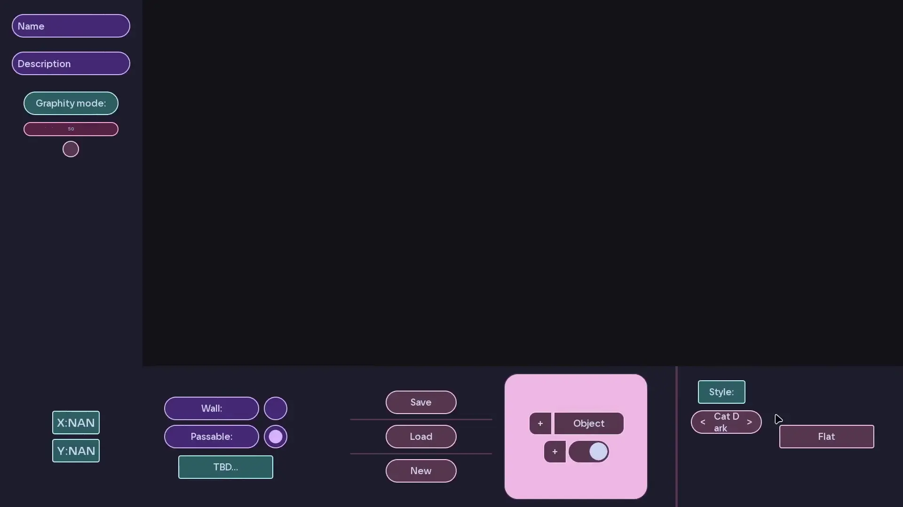

<p align="center">
  
</p>


<a href="https://golembebrov.github.io/nevu-docs/">Nevu-UI Documentation</a>

**Nevu UI** is a GUI library for easily creating interfaces in `Python`, which provides a set of ready-made, customizable components and convenient tools for creating interfaces in games and applications.

### Key features:
*   **Layouts:** Containers that automatically position elements inside themselves, for example `Grid`, `ScrollableColumn`.
*   **Widgets:** Ready-made graphical elements, for example `Button`, `Label`, `Input`.
*   **Styling:** Customization of the widgets' appearance via `Style` to suit your needs.
*   **Animations:** Support for animations via `AnimationManager`.
*   **Different UI creation modes** Support for declarative and imperative creation, with the ability to combine them.
*   **Multiple backends**: Support for `Raylib` and `Pygame`
*   **Easy integration:** Ability to embed `nevu-ui` into an existing game or application using `InitializedWindow`.
---


<br>

<p align="left">
  
</p>

---


---


--- 



---

### Example: Button in a 3x3 Grid
<h3>Declarative approach</h3>

```python
import pygame

# Import nevu-ui
import nevu_ui as ui

pygame.init()

window = ui.Window(size = (400, 300), title = "Nevu-UI application")

# Create a style with some visual parameters
style = ui.Style(border_radius = 20, colortheme = ui.ColorThemeLibrary.material3_dark)

# Create the main menu
menu = ui.Menu(window, size = ui.fill_all, style = style,
    # Create a 3x3 grid
    main_layout = ui.Grid(
        {
            (2, 2): ui.Button( # Create a button in cell 2, 2 (counting from 1)
                text = "Click me!",
                function = lambda: print("You clicked!"),
                size = (50 % ui.fill, 20 % ui.fill),
                style = style
            )
        },
        size = ui.fill_all,
        row = 3,
        column = 3
    )
)

if __name__ == "__main__":
    app = ui.Manager(window, [menu])
    app.run() # Run the main loop
```
<h3>Imperative approach</h3>

```python
import pygame

# Import nevu-ui
import nevu_ui as ui

pygame.init()

# Create the main application window
window = ui.Window(size = (400, 300), title = "Nevu-UI application")

# Create a style with some visual parameters
style = ui.Style(
    border_radius = 20,
    colortheme = ui.ColorThemeLibrary.material3_dark
)

# Create the initial container
menu = ui.Menu(window, size = (100 % ui.vw, 100 % ui.vh), style = style)

# Create a 3x3 grid
grid = ui.Grid(size = ui.fill_all, row = 3, column = 3)

button = ui.Button(
    text = "Click me!",
    function = lambda: print("You clicked!"),
    size = (50 % ui.fill, 20 % ui.fill),
    style = style
)

# Add the widget to the cell at coordinates 2, 2 (counting from 1)
grid.add_item(button, x = 2, y = 2)

# Pass the grid to the menu
menu.main_layout = grid

if __name__ == "__main__":
    while True:
        events = pygame.event.get()

        # Update the window
        window.update(events)

        # Update and draw the menu
        menu.update()
        menu.draw()

        pygame.display.update()
```


### Example Result:


<br>

<p align="left">
  
</p>

---


### Declarativeness

  *   **Interface creation:**
      ```python
      # The layout's content can be specified directly when creating it
      my_grid = Grid({(1, 1): Button(...)}, ...)
      ```
      ```python
      # The layout can be specified right when creating the menu
      menu_1 = Menu(..., main_layout = my_grid)
      ```
      ```python
      # You can set up the draw loop in 2 lines
      app = Manager(window, [menu_1])
      app.run()
      ```
*   **Size system:** Allows using relative values to specify an object's initial height/width instead of pixels.
    Usage example:
    ```python
    from nevu_ui import vw, fill
    Widget(size = (30*vw, 50*fill))
    ```
    you can also use `%`
    ```python
    from nevu_ui import vw, fill
    Widget(size = (30%vw, 50%fill))
    ```
    Types of sizes:
    *   `vh` / `vw`: Percentage of the window's height/width.
    *   `fillx` / `filly` / `fill`: Percentage of the parent layout's height/width/size.
    *   `gc` / `gcw` / `gch`: Percentage of the grid cell's size.
    *   Prefix `c`: can be placed at the start of any value except `auto` (for example, `cvh`); it means the current size of the window/layout will be used, while without the prefix the original size is used.
    *   `auto`: automatic sizing based on content.
### Animations:
  **25+ different animations**
  * 2 animation modes:
      *   **Start:** runs once after the animation has loaded. <br>```widget.animation_manager.add_start_animation(...)```
      *   **Continuous:** runs infinitely and in a loop. <br>```widget.animation_manager.add_continuous_animation(...)```
  * 4 kinds of animations:
      1. `Vector2Animation`: a vector animation<br>Example: from (0, 0) to (10, 10)
      2. `FloatAnimation`: a numeric animation<br>Example: from 10 to 5.5
      3. `ColorAnimation`: a color animation<br>Example: from (255, 255, 200) to (0, 0, 0)
      4. `QueueAnimation`: a compound animation<br>Example: from animation1 to animation2, and from animation2 to animation3
<br>

<p align="left">
  
</p>

---

## Dependencies:
  **`Python >= 3.12`**
  * For Building:
    * `setuptools`
    * `Cython`
    * `numpy`
  * For Running:
    * `numpy`
  * Additional libraries:
    * `pygame-ce` 
    * `raylib`
    * `pyyaml`
 ## Installation via pip
 ```python
 pip install nevu-ui[all]
 ```

<br>

<p align="left">
  
</p>

---

### List of available elements

### **Layouts**

*   `Grid`
*   `Row`
*   `Column`
*   `ScrollableRow`
*   `ScrollableColumn`
*   `ColorPicker`
*   `StackColumn`
*   `StackRow`
*   `CheckBoxGroup`

### **Widgets**

*   `Widget`
*   `Button`
*   `Label`
*   `Input`
*   `EmptyWidget`
*   `Tooltip`
*   `ProgressBar`
*   `SliderBar`
*   `ElementSwitcher`
*   `RectCheckBox`
*   `Switch`

### **Available Backends**

*   `Pygame-ce`
*   `Sdl(Pygame-ce._sdl2)`
*   `RayLib`

## Backend Exclusives

* `Ripple effect on click` — **Raylib exclusive**

<br>

<p align="left">
  
</p>

---

### Nevu UI is distributed under the MIT license

<br>

<p align="left">
  
</p>

---

### `Nevu UI` may contain bugs, as it is still in beta version.
### If you find a bug, please report it in [Issues](https://github.com/GolemBebrov/nevu-ui/issues)
<br>

<p align="left">
  
</p>

---


### **Gmail:** bebrovgolem@gmail.com
### **Creator:** GolemBebrov / ГолемБебров
