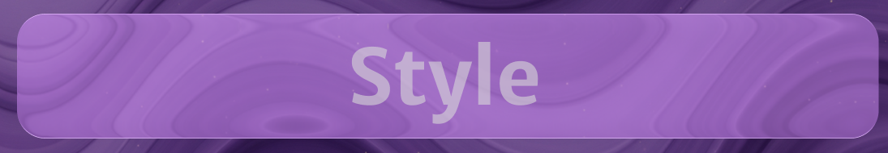
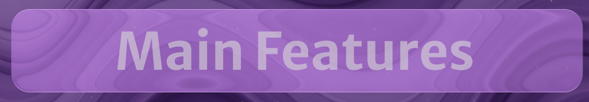
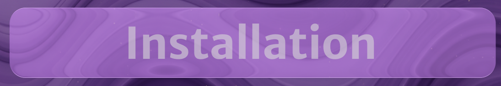
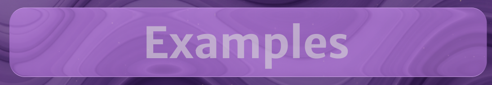
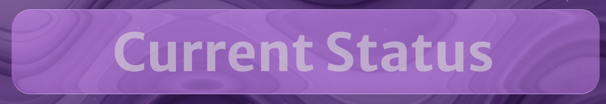
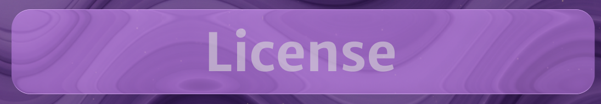
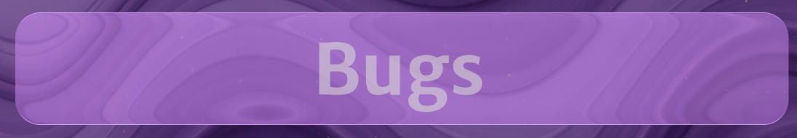
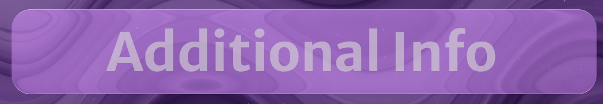

<p align="center">
  
</p>


# Wiki link (BETA!)
 * <a href="https://golembebrov.github.io/nevu-docs/">NevuDocs</a>

### Nevu UI means: `Nevu is Eleven times better Versus other UI's User Interface`

# Brief Description
**Nevu UI** is a library for simply creating GUIs in Python. Nevu UI aims to provide a set of ready-made, easily customizable components for creating interfaces in games and applications.

### Key features:
*   **Layouts:** Various container options that automatically position elements inside themselves, for example `Grid`, `ScrollableColumn`, etc.
*   **Widgets:** Ready-to-use elements such as buttons, input fields, and labels.
*   **Customization:** Support for appearance customization via `Style`, lots of customization options inside `Style`.
*   **Animations:** Built-in support for animations via `AnimationManager`.
*   **Declarativeness:** Support for declarative interface creation.

<br>

<p align="left">
  
</p>

---

### `Style` - storage of parameters for appearance customization

* **`gradient`**
  * Gradient is supported in all backends, and there are 2 types of gradient: linear and radial.
* **`color_theme`**
  * Analogous to MaterialDesign, responsible for the visual component of the widget and menu. You can choose from 10+ ready-made themes or create your own theme.
* **`font_name`/`font_size`**
  * Controls the font size on widgets that contain it.
* **`border_width`/`bw`**
  * Allows changing the border size.
* **`border_radius`/`br`**
  * Allows changing the border corner radius.

and so on...

<br>

<p align="left">
  
</p>

---

### Declarativeness and its examples in Nevu UI

*   **Declarative approach:** Describe your interface declaratively.
    ```python
    # Specify content directly when creating the layout
    my_grid = Grid(..., content={(1,1): Button(...)})
    ```
*   **Adaptive size system - `SizeRules`:** Allows using relative values to specify the initial height/width of an object instead of pixels.
    Example of using `SizeRule`:
    ```python
    Widget(size = (30*vw, 50*fill))
    ```
    or you can use `%`
    ```python
    Widget(size = (30%vw, 50%fill))
    ```
    *   `vh` / `vw`: Percentage of the window's height/width.
    *   `fillx` / `filly` / `fill`: Percentage of the parent layout's height/width/size.
    *   `gc` / `gcw` / `gch`: Percentage of the grid cell size.
    *   Prefix `c`: can be placed in any SizeRule, it means that the current value will be taken; without the prefix, the original value will be taken.
### Built-in animations:
  * **25+ built-in animations**
  * Nevu UI has **Two** types of animations:
      *   **Start**.
      *   **Continuous**.
  * Usage example:
     * **Start:**
       ```widget.animation_manager.add_start_animation(...)```
     * **Continuous:**
       ```widget.animation_manager.add_continuous_animation(...)```

### Parameter system - ParamEngine:

*   `ParamEngine` is a tool built into all layouts and widgets, it allows you to:
    * Add variables to the object's `__init__`.
    * Check parameter type during initialization and after.
    * Integrate a parameter into different stages of initialization.
    * Set custom setter and getter.
*   **Examples:**
    ```python
    import nevu_ui as ui
    from typing import Unpack, NotRequired

    # Create a TypedDict with variables (optional, but looks nice)
    class MyWidgetKwargs(ui.WidgetKwargs):
        my_var: NotRequired[int | float]

    class MyWidget(ui.Widget):
        def __init__(self, size: NvVector2 | list, style: Style = default_style, **param_kwargs: Unpack[MyWidgetKwargs]):
            super().__init__(size, style, **param_kwargs)

        # Override the function to add parameters (mandatory)
        def _add_params(self):
            super()._add_params()

            # Add a parameter (mandatory)
            self._add_param('my_var', int | float)

            # You can also add a link to a parameter
            # self._add_param_link('my_var', 'my_var_new_name')

            # You can also block a parameter if necessary
            # self._block_param('my_var')
    ```

<br>

<p align="left">
  
</p>

---
  ## Dependencies:
  **```Python >= 3.12.*```**
  * For Building:
    * ```setuptools >= 61.0```
    * ```Cython```
    * ```numpy```
  * For Running:
    * ```numpy```
  * Additional libraries:
    * ```pygame-ce>=2.3.0``` 
    * ```raylib```
    * ```pyyaml```
 ## Installation via pip
 ```python
 pip install nevu-ui[all]
 ```

<br>

<p align="left">
  
</p>

---

---


---
### Basic Grid
#### Declarative Approach
```python
import nevu_ui as ui # Import Nevu UI
import pygame

pygame.init()

class MyGame(ui.Manager): # Create the base of our application
    def __init__(self):
        super().__init__(ui.Window((400, 300), title = "My Game")) # Initialize the manager
        style = ui.Style(borderradius=20, colortheme=ui.ColorThemeLibrary.material3_dark) # Create Style (optional)
        self.menu = ui.Menu(self.window, [100%ui.vw, 100%ui.vh], style = style, # Create a menu
                            layout= ui.Grid([100%ui.vw, 100%ui.vh], row=3, column=3, # Create a grid layout
                                            content = {
                                                (2, 2): ui.Button(lambda: print("You clicked!"), "BUTTON!", [50%ui.fill, 50%ui.gc], style=style) # Create a button
                                            }
                                            )
                            )
    def on_draw(self):
        self.menu.draw() # Draw the menu
    def on_update(self, events):
        self.menu.update() # Update the menu

game = MyGame()
game.run() # Run the finished application
```
#### Imperative Approach
```python
import nevu_ui as ui # Import Nevu UI
import pygame

pygame.init()

window = ui.Window((400, 300), title = "My Game") # Create a window

style = ui.Style(borderradius=20, colortheme=ui.ColorThemeLibrary.material3_dark) # Create Style
menu = ui.Menu(window, [100%ui.vw, 100%ui.vh], style=style) # Create a menu
layout = ui.Grid([100%ui.vw, 100%ui.vh], row=3, column=3) # Create a grid layout
layout.add_item(ui.Button(lambda: print("You clicked!"), "BUTTON!", [50%ui.fill, 50%ui.gc], style=style), x = 2, y = 2) # Create a button

menu.layout = layout # Set the menu layout

while True: # Main loop
    events = pygame.event.get() # Get events
    window.update(events) # Update the window
    menu.update() # Update the menu
    menu.draw() # Draw the menu
    pygame.display.update() # Update the screen

```


### Example Result


<br>

<p align="left">
  
</p>

---

### Current status of Nevu UI.

### **Layouts (Inheritors of Layout_Type)**

(✅ — done, ❌ — not done, 💾 — deprecated/not working)

*   ✅ `Grid`
*   ✅ `Row`
*   ✅ `Column`
*   ✅ `ScrollableRow`
*   ✅ `ScrollableColumn`
*   ✅ `ColorPicker`
*   💾 `Pages`
*   💾 `Gallery_Pages`
*   ✅ `StackColumn`
*   ✅ `StackRow`
*   ✅ `CheckBoxGroup`
*   ✅ `Panel`

### **Widgets (Inheritors of Widget)**

*   ✅ `Widget`
*   ✅ `Button`
*   ✅ `Label`
*   ✅ `Input`
*   ✅ `EmptyWidget`
*   ✅ `Tooltip`
*   💾 `Gif`
*   ❌ `MusicPlayer` (Will be reworked, hopefully)
*   ✅ `ProgressBar`
*   ✅ `SliderBar`
*   ✅ `ElementSwitcher`
*   💾 `FileDialog`
*   ✅ `RectCheckBox`
*   ✅ `Switch`

### **Available Backends**

*   ✅ `Pygame-ce`
*   ✅ `Sdl(Pygame-ce._sdl2)`
*   ✅ `RayLib`

## Backend Exclusives

* `Ripple effect` — **Raylib exclusive**
* `Customizable center and angle of the gradient` — **Raylib exclusive**
* `Tooltip` — **Pygame exclusive**

<br>

<p align="left">
  
</p>

---
### Nevu UI is protected by the MIT license

<br>

<p align="left">
  
</p>

---
### `Nevu UI` is **NOT** a stable framework, you may encounter many bugs in it.
### If you find a bug, please report it in the [Issues](https://github.com/GolemBebrov/nevu-ui/issues) section
<br>

<p align="left">
  
</p>

---


### **Gmail:** bebrovgolem@gmail.com
### **Creator:** Nikita A.
