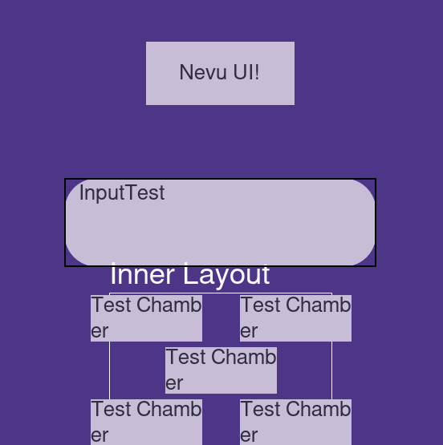
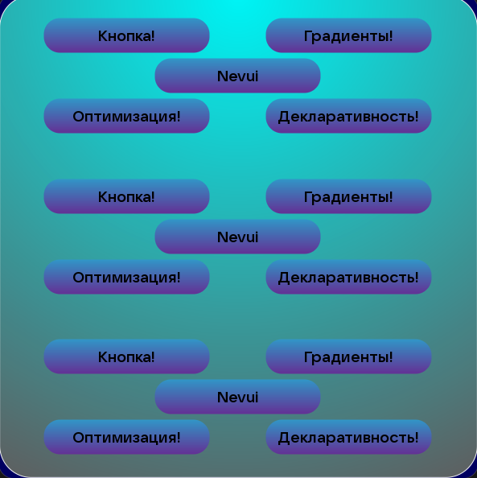
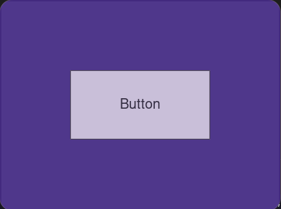

# Краткое описание
**Nevu UI** — это библиотека для декларативного создания пользовательских интерфейсов в среде python. Проект нацелен на предоставление разработчикам набора готовых, стилизуемых и расширяемых компонентов для быстрого создания современных и отзывчивых интерфейсов в игровых и мультимедийных приложениях.

#### Главная цель Nevu UI: сделать создание интерфейсов на python еще легче и быстрее

### Ключевые особенности включают:
*   **Система макетов:** Удобное расположение элементов, например с помощью сеток (Grid) и прокручиваемых контейнеров (ScrollableColumn).
*   **Набор виджетов:** Готовые к использованию элементы, такие как кнопки, поля ввода и метки.
*   **Гибкая стилизация:** Возможность кастомизации внешнего вида через систему стилей, поддерживающую цвета, градиенты и рамки.
*   **Анимации:** Встроенная поддержка анимаций для создания динамичных и живых интерфейсов.
*   **Декларативность:** Поддержка декларативного создания интерфейса

## Стиль

### Style - хранилище параметров для кастомизации внешнего вида
Изменяемые параметры:

* **Gradient** 
* **ColorTheme** - Аналог MaterialDesign, есть готовый набор тем - `ColorThemeLibrary`
* **Font name/size**
* **Border Width/Radius**
* **Text Align X/Y**
* **Transparency**

## Главные особенности

### Nevu UI позволяет описывать интерфейс с ясной структурой 

 Примеры декларативности:

*   **Декларативный подход:** Описывайте ваш интерфейс так же, как вы его видите.
    ```python
    # Указывайте контент прямо при создании макета
    grid = ui.Grid(content={(1,1): ui.Button(...)})
    ```
*   **Адаптивная система размеров (`SizeRules`):** Забудьте о пикселях. Используйте относительные величины, которые подстраиваются под размер окна или родительского элемента.
    *   `vh` / `vw`: Проценты от высоты/ширины окна.
    *   `fillx` / `filly` / `fill`: Проценты от высоты/ширины/размера родительского макета.
    *   `gc` / `gcw` / `gch`: Проценты от размера ячейки сетки.
    *   Префикс `c`: можно поставить в любой SizeRule, он означает что будет братся нынешняя величина (без префикса будет браться оригинальная)
*   **Мощная система стилей:** Настраивайте каждый аспект внешнего вида с помощью универсального объекта `Style`.
    *   **Темы:** Готовые цветовые темы в `ColorThemeLibrary`.
    *   **Градиенты:** Поддержка линейных и радиальных.
    *   **Наследование:** Стили можно создавать на основе уже существующих.
    *   **И многое другое:** Шрифты, рамки, скругления, прозрачность.
*   **Встроенные анимации:** Оживите ваш интерфейс с помощью готовых анимаций движения, прозрачности и т.д.
    * Есть **2** типа анимаций: 
        *   **Стартовая** - Позволяет задать начальное появление виджета.
        *   **Бесконечная** - Производит бесконечную анимацию заданную в `animation_manager`.
    * Пример использования:
       * **Стартовая:**
        ```widget.animation_manager.add_start_animation(ui.animations.EaseOut(...))```
       * **Бесконечная:**
        ```widget.animation_manager.add_continuous_animation(ui.animations.EaseOut(...))```

**Система параметров** (ParamEngine):

*   `ParamEngine` это удобный инструмент встроенный во все макеты и виджеты, он позволяет:
    * Декларативно добавлять переменные в `__init__` обьекта
    * Проверять тип переменной во время инициализации и после
    * Достать значения параметра можно через `self.get_param(param_name).get()`
    * Записать значение параметра можно через `self.get_param(param_name).set(value)`
*   **Примеры:**
    *   ```python 
        import nevu_ui as ui
        from typing import Unpack, NotRequired

        #Создаем TypedDict с переменными (необязательно, но красиво)
        class MyWidgetKwargs(ui.WidgetKwargs):
            my_var: NotRequired[int | float] 

        class MyWidget(ui.Widget):
            def __init__(self, size: NvVector2 | list, style: Style = default_style, **constant_kwargs: Unpack[MyWidgetKwargs]):
                super().__init__(size, style, **constant_kwargs)
            
            #Переопределяем функцию для добавления параметров (обязательно)
            def _add_params(self):
                super()._add_params()

                #Добавляем параметр (обязательно)
                self._add_param('my_var', int | float)

                #Можно еще добавить ссылку на параметр
                #self._add_param_link('my_var', 'my_var_new_name')

                #Также можно заблокировать параметр при необходимости
                #self._block_param('my_var')
        ```

# Установка
  ## Зависимости:
  **```Python >= 3.12.*```**
  * Для Сборки:
    * ```setuptools >= 61.0```
    * ```Cython```
    * ```numpy```
  * Для Запуска:
    * ```pygame-ce>=2.3.0``` 
    * ```numpy```
    * ```Pillow```
    * ```moderngl```
 ## Установка через pip
 ```python 
 pip install nevu-ui
 ```

# Примеры

---



---
### Базовая сетка
#### Декларативный подход
```python
import nevu_ui as ui #Импортируем Nevu UI
import pygame

pygame.init()

class MyGame(ui.Manager): #Создаем базу нашего приложения
    def __init__(self):
        super().__init__(ui.Window((400, 300), title = "My Game")) #Инициализируем менеджер
        style = ui.Style(borderradius=20, colortheme=ui.ColorThemeLibrary.material3_teal) #Создаем Style (необязательно)
        self.menu = ui.Menu(self.window, [100%ui.vw, 100%ui.vh], style = style, #Создаем меню
                            layout= ui.Grid([100%ui.vw, 100%ui.vh], row=3, column=3, #Создаем макет grid
                                            content = { 
                                                (2, 2): ui.Button(lambda: print("You clicked!"), "КНОПКА!", [50%ui.fill, 50%ui.gc], style) #Создаем кнопку
                                            }
                                            )
                            )
    def on_draw(self):
        self.menu.draw() #рисуем меню
    def on_update(self, events):
        self.menu.update() #обновляем меню

game = MyGame()
game.run() #Запускаем готовое приложение
```
#### Императивный подход
```python
import nevu_ui as ui #Импортируем Nevu UI
import pygame

pygame.init()

window = ui.Window((400, 300), title = "My Game") #Создаем окно

menu = ui.Menu(window, [100*ui.vw, 100*ui.vh]) #Создаем меню

layout = ui.Grid([100*ui.vw, 100*ui.vh], row=3, column=3) #Создаем макет grid
layout.add_item(ui.Button(lambda: print("You clicked!"), "Button", [50*ui.fill,33*ui.fill]), x = 2, y = 2) #Создаем кнопку

menu.layout = layout #Задаем макет меню

while True: #Главный цикл
    events = pygame.event.get() #Получаем события
    window.update(events) #Обновляем окно
    menu.update() #Обновляем меню
    menu.draw() #Рисуем меню
    pygame.display.update() #Обновляем экран
    
```


### Результат примера

---
# Статус Nevu UI на данный момент

### **Макеты (Наследники Layout_Type)**

(✅ - сделано, ❌ - не сделано, 💾 - устарело/не работает)

*   ✅ `Grid`
*   ✅ `Row`
*   ✅ `Column`
*   ✅ `ScrollableRow`
*   ✅ `ScrollableColumn`
*   ✅ `ColorPicker`
*   💾 `Pages`
*   💾 `Gallery_Pages`
*   ✅ `StackColumn`
*   ✅ `StackRow`
*   ✅ `CheckBoxGroup`

### **Виджеты (Наследники Widget)**

*   ✅ `Widget`
*   ✅ `Button`
*   ✅ `Label`
*   ✅ `Input`
*   ✅ `EmptyWidget`
*   ✅ `Tooltip` 
*   💾 `Image`
*   💾 `Gif`
*   ❌ `MusicPlayer` (Будет переработан, надеюсь)
*   ✅ `ProgressBar`
*   ✅ `SliderBar`
*   ✅ `ElementSwitcher`
*   💾 `FileDialog`
*   ✅ `RectCheckBox`

### **Доступные бекэнды**

*   ✅ `Pygame-ce`
*   ✅ `Pygame-ce._sdl2`
*   ✅ `RayLib` (BETA)

# Лицензия

**Nevu UI защищен лицензией MIT**

# Дополнительная информация

* **Gmail:** bebrovgolem@gmail.com
* **Создатель:** Никита А.