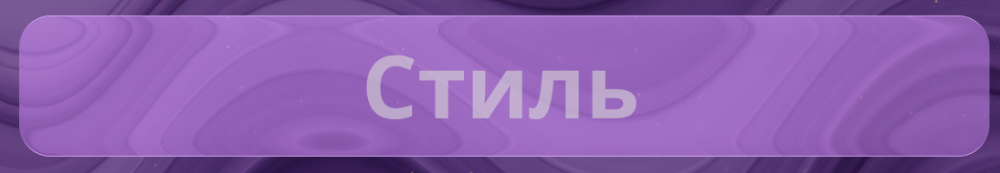
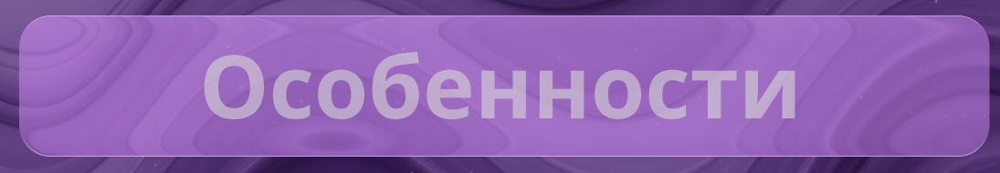
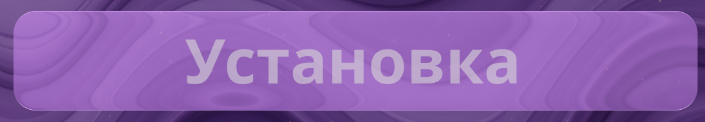
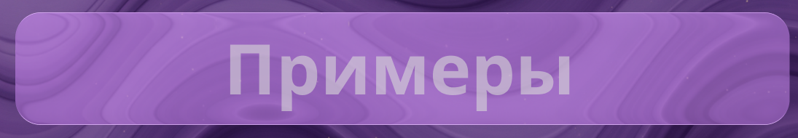
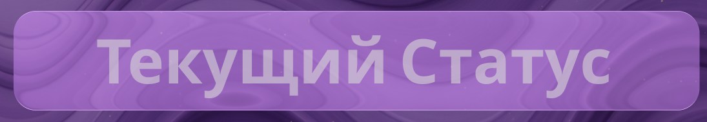
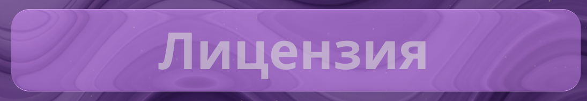
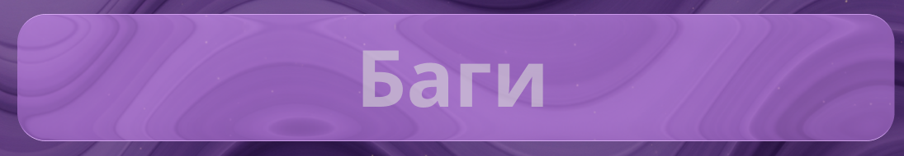
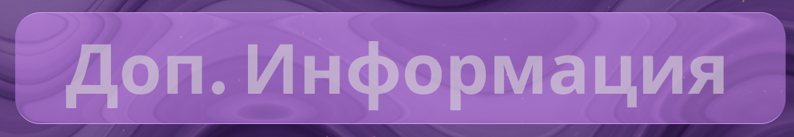

<p align="center">
  
</p>


# Wiki ссылка (БЕТА!)
 * <a href="https://golembebrov.github.io/nevu-docs/">NevuDocs</a>

### Nevu UI означает: `Nevu is Eleven times better Versus other UI's User Interface`

# Краткое описание
**Nevu UI** — это библиотека для декларативного создания пользовательских интерфейсов на python. Проект нацелен на предоставление разработчикам набора готовых, стилизуемых и расширяемых компонентов для быстрого создания современных и отзывчивых интерфейсов в игровых и мультимедийных приложениях.

#### Главная цель Nevu UI: сделать создание интерфейсов на python еще легче и быстрее

### Ключевые особенности включают:
*   **Система макетов:** Удобное расположение элементов, например, с помощью сеток (Grid) и прокручиваемых контейнеров (ScrollableColumn).
*   **Набор виджетов:** Готовые к использованию элементы, такие как кнопки, поля ввода и метки.
*   **Гибкая стилизация:** Возможность кастомизации внешнего вида через систему стилей, поддерживающую цвета, градиенты и рамки.
*   **Анимации:** Встроенная поддержка анимаций для создания динамичных и живых интерфейсов.
*   **Декларативность:** Поддержка декларативного создания интерфейса.

<br>

<p align="left">
  
</p>

---

### Стиль — хранилище параметров для кастомизации внешнего вида
Изменяемые параметры:

* **Gradient**
* **ColorTheme** — Аналог MaterialDesign, есть готовый набор тем — `ColorThemeLibrary`
* **Font name/size**
* **Border Width/Radius**
* **Text Align X/Y**
* **Transparency**

<br>

<p align="left">
  
</p>

---

### Nevu UI позволяет описывать интерфейс с ясной структурой

Примеры декларативности:

*   **Декларативный подход:** Описывайте ваш интерфейс так же, как вы его видите.
    ```python
    # Указывайте контент прямо при создании макета
    grid = ui.Grid(content={(1,1): ui.Button(...)})
    ```
*   **Адаптивная система размеров (`SizeRules`):** Забудьте о пикселях. Используйте относительные величины, которые подстраиваются под размер окна или родительского элемента.
    *   `vh` / `vw`: Проценты от высоты/ширины окна.
    *   `fillx` / `filly` / `fill`: Проценты от высоты/ширины/размера родительского макета.
    *   `gc` / `gcw` / `gch`: Проценты от размера ячейки сетки.
    *   Префикс `c`: можно поставить в любой SizeRule, он означает, что будет браться текущая величина (без префикса будет браться оригинальная).
*   **Мощная система стилей:** Настраивайте каждый аспект внешнего вида с помощью универсального объекта `Style`.
    *   **Темы:** Готовые цветовые темы в `ColorThemeLibrary`.
    *   **Градиенты:** Поддержка линейных и радиальных.
    *   **Картинка:** Поддержка фонового изображения через параметр `bgimage`.
    *   **И многое другое:** Шрифты, рамки, скругления, прозрачность.
*   **Встроенные анимации:** Оживите ваш интерфейс с помощью готовых анимаций движения, прозрачности и т.д.
    * **25+ встроенных анимаций**
    * Есть **2** типа анимаций:
        *   **Стартовая** — Позволяет задать начальное появление виджета.
        *   **Бесконечная** — Производит бесконечную анимацию, заданную в `animation_manager`.
    * Пример использования:
       * **Стартовая:**
         ```widget.animation_manager.add_start_animation(ui.animations.EaseOut(...))```
       * **Бесконечная:**
         ```widget.animation_manager.add_continuous_animation(ui.animations.EaseOut(...))```

**Система параметров** (ParamEngine):

*   `ParamEngine` — это удобный инструмент, встроенный во все макеты и виджеты, он позволяет:
    * Декларативно добавлять переменные в `__init__` объекта.
    * Проверять тип переменной во время инициализации и после.
    * Встраивать параметр в разные этапы инициализации.
    * Доставать значения параметра через `self.get_param(param_name).get()`.
    * Записывать значения параметра через `self.get_param(param_name).set(value)`.
*   **Примеры:**
    ```python
    import nevu_ui as ui
    from typing import Unpack, NotRequired

    # Создаем TypedDict с переменными (необязательно, но красиво)
    class MyWidgetKwargs(ui.WidgetKwargs):
        my_var: NotRequired[int | float]

    class MyWidget(ui.Widget):
        def __init__(self, size: NvVector2 | list, style: Style = default_style, **param_kwargs: Unpack[MyWidgetKwargs]):
            super().__init__(size, style, **param_kwargs)

        # Переопределяем функцию для добавления параметров (обязательно)
        def _add_params(self):
            super()._add_params()

            # Добавляем параметр (обязательно)
            self._add_param('my_var', int | float)

            # Можно еще добавить ссылку на параметр
            # self._add_param_link('my_var', 'my_var_new_name')

            # Также можно заблокировать параметр при необходимости
            # self._block_param('my_var')
    ```

<br>

<p align="left">
  
</p>

---
  ## Зависимости:
  **```Python >= 3.12.*```**
  * Для Сборки:
    * ```setuptools >= 61.0```
    * ```Cython```
    * ```numpy```
  * Для Запуска:
    * ```numpy```
    * ```Pillow```
  * Дополнительные библиотеки:
    * ```pygame-ce>=2.3.0``` 
    * ```raylib```
    * ```pyyaml```
 ## Установка через pip
 ```python
 pip install nevu-ui[all]
 ```

<br>

<p align="left">
  
</p>

---

---


---
### Базовая сетка
#### Декларативный подход
```python
import nevu_ui as ui # Импортируем Nevu UI
import pygame

pygame.init()

class MyGame(ui.Manager): # Создаем базу нашего приложения
    def __init__(self):
        super().__init__(ui.Window((400, 300), title = "My Game")) # Инициализируем менеджер
        style = ui.Style(borderradius=20, colortheme=ui.ColorThemeLibrary.material3_dark) # Создаем Style (необязательно)
        self.menu = ui.Menu(self.window, [100%ui.vw, 100%ui.vh], style = style, # Создаем меню
                            layout= ui.Grid([100%ui.vw, 100%ui.vh], row=3, column=3, # Создаем макет grid
                                            content = {
                                                (2, 2): ui.Button(lambda: print("You clicked!"), "КНОПКА!", [50%ui.fill, 50%ui.gc], style=style) # Создаем кнопку
                                            }
                                            )
                            )
    def on_draw(self):
        self.menu.draw() # Рисуем меню
    def on_update(self, events):
        self.menu.update() # Обновляем меню

game = MyGame()
game.run() # Запускаем готовое приложение
```
#### Императивный подход
```python
import nevu_ui as ui # Импортируем Nevu UI
import pygame

pygame.init()

window = ui.Window((400, 300), title = "My Game") # Создаем окно

style = ui.Style(borderradius=20, colortheme=ui.ColorThemeLibrary.material3_dark) # Создаем Style
menu = ui.Menu(window, [100%ui.vw, 100%ui.vh], style=style) # Создаем меню
layout = ui.Grid([100%ui.vw, 100%ui.vh], row=3, column=3) # Создаем макет grid
layout.add_item(ui.Button(lambda: print("You clicked!"), "КНОПКА!", [50%ui.fill, 50%ui.gc], style=style), x = 2, y = 2) # Создаем кнопку

menu.layout = layout # Задаем макет меню

while True: # Главный цикл
    events = pygame.event.get() # Получаем события
    window.update(events) # Обновляем окно
    menu.update() # Обновляем меню
    menu.draw() # Рисуем меню
    pygame.display.update() # Обновляем экран

```


### Результат примера


<br>

<p align="left">
  
</p>

---

### Статус Nevu UI на данный момент.

### **Макеты (Наследники Layout_Type)**

(✅ — сделано, ❌ — не сделано, 💾 — устарело/не работает)

*   ✅ `Grid`
*   ✅ `Row`
*   ✅ `Column`
*   ✅ `ScrollableRow`
*   ✅ `ScrollableColumn`
*   ✅ `ColorPicker`
*   💾 `Pages`
*   💾 `Gallery_Pages`
*   ✅ `StackColumn`
*   ✅ `StackRow`
*   ✅ `CheckBoxGroup`
*   ✅ `Panel`

### **Виджеты (Наследники Widget)**

*   ✅ `Widget`
*   ✅ `Button`
*   ✅ `Label`
*   ✅ `Input`
*   ✅ `EmptyWidget`
*   ✅ `Tooltip` (Pygame эксклюзив, пока что)
*   💾 `Gif`
*   ❌ `MusicPlayer` (Будет переработан, надеюсь)
*   ✅ `ProgressBar`
*   ✅ `SliderBar`
*   ✅ `ElementSwitcher`
*   💾 `FileDialog`
*   ✅ `RectCheckBox`
*   ✅ `Switch`

### **Доступные бэкенды**

*   ✅ `Pygame-ce`
*   ✅ `Pygame-ce._sdl2(Sdl)`
*   ✅ `RayLib`

## Бэкенд эксклюзивы

* `Ripple эффект` — **Raylib эксклюзив**
* `Прозрачные цвета внутри Gradient` — **Raylib эксклюзив**
* `Настраиваемый центр и угол градиента` — **Raylib эксклюзив**
* `Tooltip` — **Pygame эксклюзив**

<br>

<p align="left">
  
</p>

---
### Nevu UI защищен лицензией MIT

<br>

<p align="left">
  
</p>

---
### `Nevu UI` — **НЕ** стабильный фреймворк, в нем могут встретиться много багов.
### Если вы нашли баг, пожалуйста, сообщите о нем в разделе [Issues](https://github.com/GolemBebrov/nevu-ui/issues)
<br>

<p align="left">
  
</p>

---


### **Gmail:** bebrovgolem@gmail.com
### **Создатель:** Никита А.